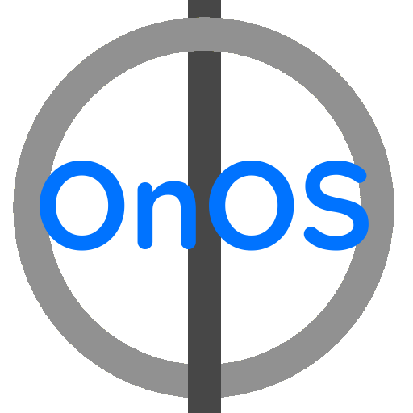

# What is OnOS?

OnOS is a custom linux distro made from scratch  

# What can you do with OnOS

You can do whatever you want as long as it's present in the OS 

# Why can you not download old releases?

Cus i'm fucking running out of google drive storage, ion have 10 terrabytes of storage on google drive

# Everything used that is not made by me

1. Nano
2. Cowsay
3. Linux Kernel
4. Coreutils
5. OpenRC
6. Linux Firmware
7. agetty
8. Busybox (partially)
9. Kmod
10. blk utils
11. mpv
12. bash
13. GRUB
And many more i prolly forgot
